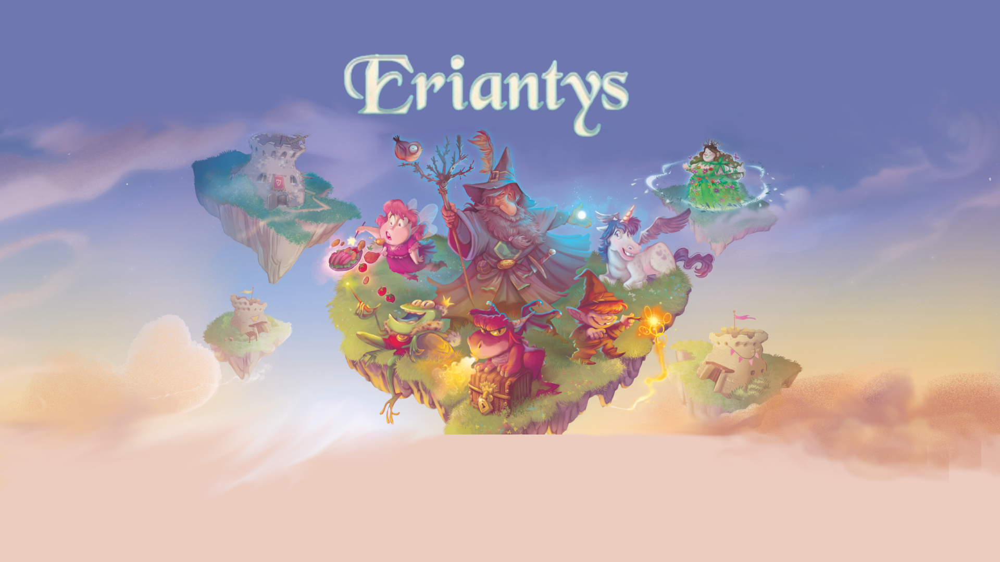

# Eriantys<br>
## Progetto finale di gruppo relativo all'insegnamento "Ingegneria del Software" di Ingegneria Informatica al Politecnico di Milano. 2022-2023<br>

Si chiede di implementare una versione del gioco da tavolo Eriantys. 

<!-- PROJECT LOGO -->
<br />
<div align="center">
  <a href="https://github.com/othneildrew/Best-README-Template">
    
  </a>
</div>

<!-- TABLE OF CONTENTS -->
<details>
  <summary>Table of Contents</summary>
  <ol>
    <li>
      <a href="#about-the-project">About The Project</a>
    </li>
    <li>
      <a href="#getting-started">Getting Started</a>
      <ol>
        <li><a href="#prerequisites">Prerequisites</a></li>
        <li><a href="#usage">Usage</a>
          <ol>
            <li><a href="#starting-the-server">Starting the Server</a></li>
            <li><a href="#starting-the-client">Starting the Client</a></li>
          </ol>
        </li>
      </ol>
    </li>
    <li><a href="#how-to-play">How to play</a>
      <ul>
        <li><a href="#cli">CLI</a></li>
        <li><a href="#gui">GUI</a></li>
       </ul>
    </li>
    <li><a href="#code-coverage">Code Coverage</a></li>
    <li><a href="#contacts">Contacts</a></li>
  </ol>
</details>


<!-- ABOUT THE PROJECT -->
## About The Project

This is an implementation of the game "Eriantys" from Cranio Creations.<br>
The project has been realized accordingly to the specifications provided [HERE](https://github.com/MarcoRiva6/ing-sw-2022-portentoso-riva-ronzani/blob/master/requirements.pdf).

The generic features implemented are:
* The **complete** rules set
* The online multiplayer via Sockets
* The command line interface (CLI)
* The graphical user interface (GUI)

The advanced features implemented are **3**:
* All 12 of the Npc cards (effect cards)
* Multiple simultaneous games (via a lobby for each game)
* Resilience and recovery from disconnections

You can read the rules for the game [HERE](https://github.com/MarcoRiva6/ing-sw-2022-portentoso-riva-ronzani/blob/master/Eriantys_rules.pdf).

What follows is a brief explanation of how to use the different features of the project.

<p align="right">(<a href="#top">back to top</a>)</p>


<!-- GETTING STARTED -->
## Getting Started

Then you only need to download the release files, the final jars con be found [HERE](https://github.com/MarcoRiva6/ing-sw-2022-portentoso-riva-ronzani/blob/master/deliverables).

### Prerequisites

Your machine has to have:
* Java version 17 or higher
* 80MB of storage available
* 4GB of RAM or more

### Usage

#### Starting the Server

In order to play the game you first need to start **Server.jar** either on your local machine, or
on another one as long as you can reach it through the network on port **31234**.<br>
The expected console output is, for example:
```
>java -jar Server.jar
Starting server on test-PC/192.168.56.1:31234...
```

#### Starting the Client

When the server is running you can then connect with clients by running **Client.jar**.
The startup procedure consists of:

1. Choosing a server, that can be done in 3 ways:
   * With the server's URL as for example ```https://www.example.com``` or ```www.myownurl.ex```
   * With the server's IP as for example ```127.0.0.1```
   * Directly choosing ```localhost``` by simply pressing ENTER
2. Choosing the User Interface:
   * CLI by typing ```c``` or by simply pressing ENTER
   * GUI by typing ```g```

Example of running the CLI:
```
>java -jar Client.jar

    .-''-.   .-------.     .-./`)     ____     ,---.   .--. ,---------.     ____     __     .-'''-.
  .'_ _   \  |  _ _   \    \ .-.')  .'  __ `.  |    \  |  | \          \    \   \   /  /   / _     \
 / ( ` )   ' | ( ' )  |    / `-' \ /   '  \  \ |  ,  \ |  |  `--.  ,---'     \  _. /  '   (`' )/`--'
. (_ o _)  | |(_ o _) /     `-'`"` |___|  /  | |  |\_ \|  |     |   \         _( )_ .'   (_ o _).
|  (_,_)___| | (_,_).' __   .---.     _.-`   | |  _( )_\  |     :_ _:     ___(_ o _)'     (_,_). '.
'  \   .---. |  |\ \  |  |  |   |  .'   _    | | (_ o _)  |     (_I_)    |   |(_,_)'     .---.  \  :
 \  `-'    / |  | \ `'   /  |   |  |  _( )_  | |  (_,_)\  |    (_(=)_)   |   `-'  /      \    `-'  |
  \       /  |  |  \    /   |   |  \ (_ o _) / |  |    |  |     (_I_)     \      /        \       /
   `'-..-'   ''-'   `'-'    '---'   '.(_,_).'  '--'    '--'     '---'      `-..-'          `-...-'


Hey there! You have to choose a server via:
    * the server URL as "www.example.url" or "https://www.text.org"
    * the server IP as X.X.X.X
    * directly press ENTER for localhost

>127.0.0.1
IP: 127.0.0.1

Select you user interface, type "c" for the CLI or "g" for the GUI:
>c
```

<br><br>
**Important note:** it is intended that running multiple instances of the same **client.jar** ends up in the following output if **client.dat** is present.
```
Reconnection with previous credentials failed,
press "enter" to continue and please choose a new nickname...

Error: nickname already in use
Code: 3
```
however, <u>this is intended</u>, continuing by pressing ENTER (CLI) or typing in a nickname (GUI) will start the client as usual.<br>
This is a consequence of the feature that recovers the previous session even after a forceful termination of the program.
<br>
See <a href="#the-recovery-system">The recovery system</a> for more details.

<p align="right">(<a href="#top">back to top</a>)</p>


<!-- HOW TO PLAY -->
## How to play

First, a quick introduction to three important mechanics:
* <a href="#the-lobby-system">The lobby system</a>
* <a href="#the-reconnection-system">The reconnection system</a>
* <a href="#the-recovery-system">The recovery system</a>

#### The lobby system

In order to handle multiple game instances at once, the server creates each instance inside a lobby.<br>
Immediately after you log in, you are presented with a list of the already available lobbies, with the possibility
of both joining an existing lobby with a free player slot, or to create your own lobby and wait for others to join.
<br><br>
When you are in a lobby, to allow the game to begin each player has to signal himself are "ready", via the dedicated
"toggle ready" button on command, only after everyone is ready the game automatically begins.
<br><br>
At the end of a game, players will be put back in the same lobby, with everyone set to "not ready", to allow
for easy rematches.
<br><br>
Furthermore, since the available lobbies on the server might change frequently, it would have been wasteful to update
the list of lobbies available client-side every time the list on the server changed.<br>Due to this both UIs implement a
**refresh** functionality (as a dedicated button, or command), to update the locally known list of available lobbies.

#### The reconnection system

This functionality to re-establish a lost connection works entirely automatically.<br>
When the client's end of the connection detects it has been severed, the client enters a state where every
second it attempts to reconnect to the server, until successful.<br>
The server, on its end, remembers disconnected clients for exactly 45 seconds after the connection was lost, and if in
this timespan the client successfully reconnects, it is given back its session and rejoins any lobby it was previously
into, being able to resume eventually ongoing games in those.<br>
However if a client's disconnection happens during a game, there is also a timer of 30 seconds after which the game
will skip the client's turn, to prevent the game from stalling for too long.
<br><br>
The client implements a ping mechanism too, sending an empty message to the server every 5 seconds, since the server
automatically closes any connection that has been inactive for 15 seconds or more this prevents clients from being
disconnected for being idle, while also preventing likely closed connections which still are waiting to be kept
alive for long before their closure is brought forward.<br>
This implies that a client losing its connection has exactly 60 seconds to join back while being put back in its previous
game, if any.

#### The recovery system

To allow a player which for whatever reason got his client process improperly terminated to not lose his session
and potentially resume a game even after that, when you log in, the client process stores your credentials in a local
file: **client.dat**, said file is than read whenever **Client.jar** is executed and potentially still valid
sessions are recovered and resume.
<br><br>
This functionality is **disabled** by default, and remains so if there isn't yet a **client.dat** file in the same
directory as **Client.jar**. Hence, if the user intends to enable this functionality it is sufficient to create a file
alongside **Client.jar** with the name **"client.dat"**.
<br><br>
The session stored in **client.dat** is invalidated whenever the client process terminates properly via either 
the ```exit``` command or the window's :x: in the GUI.
<br><br>
In the case that the recovered session is invalid (the nickname has already been taken, or there has been a server restart),
you will be prompted to insert again your nickname and start with a fresh session.

### CLI

You will be initially requested to choose a nickname, duplicate nicknames are not allowed on the same server,
so if you will be prompted to change nickname try choosing it again while do so.
```
Welcome to ERIANTYS!

Choose a nickname:
>MrTest
```

After you successfully log in, you are presented with the list of lobbies, at this point typing ```help```,
or ```h``` for short, will enable you to get an in-game list of the available commands for that exact moment
(hence the help menu changes dynamically), with attached descriptions.<br>
Here is a full list of the available commands:
```
whoami, i                                      prints your current nickname and client id
createlobby, cl [size] [expert mode]           creates a new lobby
joinlobby, jl [lobby index]                    lets you join the specified lobby
getlobbies, refresh, gl, r                     reloads the list of available lobbies
nextpage, np                                   prints the next page of available lobbies
prevpage, pp                                   prints the previous page of available lobbies
search, s [string]                             prints only the lobbies where a player's name matches the searched string

lobby, l                                       prints you current lobby
leavelobby, ll                                 makes you leave your current lobby
readiness, r                                   prints the readiness state of the players in the lobby
toggleready, tr                                toggles your readiness state inside a lobby
playcard, pc [card order value]                allows you to play the given card
sstohall, sh [student index]                   allows you to set the selected student to your hall
sstoisland, si [student index] [island index]  allows you to set the selected student on the selected island
movemn, mm [steps]                             allows you to move mother nature of the given amount of steps
choosecloud, cc [cloud index]                  allows you to pick the students from the selected cloud
                            
npcinfo, ni [npc id]                           prints the effect and the arguments needed for the selected npc
activateeffect, ae [npc id] [npc args ...]     activates the selected npc's effect
                    
quit, exit                                     terminates the program
```
So, whenever you don't know how to proceed, type  ```h```.
<br><br>
Here is an example of the CLI looks during a game, as before typing ```help``` here indicates you the next command to use, if any.


### GUI

You will need to start be choosing a nickname with the dedicated input field, duplicate nicknames are not allowed on the same server,
so if you will be prompted to change nickname try choosing it again while do so. 


After the login succeeds you will be presented with the lobby selection screen, here you can either join an already
existing lobby via the "join" button, or create your own new lobby with the "create lobby" button.<br>
Other features include the possibility to filter lobbies by searching for the nickname of a user, only lobbies
with matching user's nicknames inside will be listed.


While creating a lobby you will be presented with 4 options, one fo each game mode available:
 * 2 players with expert mode disabled
 * 2 players with expert mode enabled
 * 3 players with expert mode disabled
 * 3 players with expert mode enabled

Select one, and your lobby will be set up accordingly.


While you are waiting in a lobby for everyone to signal their readiness, the following screen allows you
to toggle your own readiness or eventually to leave your lobby, going back to the lobby selection screen.


As soon as everyone is ready the game automatically starts, and you will be presented with the game screen.


To play now you only need to **follow the text high in the center of the screen**:
 * If you have to play a card, click on the cards stack in the bottom left corner to expand your hand of cards,
   then click on the one you intend to play
 * If you have to move students, first select one from you entrance by clicking on it (you can change your selection
   at any time by clicking another student) and then click its destination, it being an island or your hall
 * If you need to move mother nature simply click on one of the highlighted islands to move it there
 * If you need to choose a cloud, click on the one you want to take
 * When you want to activate an Npc, click on it and follow the prompt to complete its activation
 
At any time keep an eye on the **log** right next to your nickname, since if you try to perform an illegal move
or fail to activate an Npc it will get explained there.

<p align="right">(<a href="#top">back to top</a>)</p>


<!-- CODE COVERAGE -->
## Code Coverage

We have tested the Model Package extensively to ensure as much as possible the correctness of game dynamics. <br>
To this end, we have developed tests aimed at verifying the correct creation of each component of the Model and tests
designed to assert the correct functioning of each playable move, plus other transversal tests. The tests are performed
both deterministically and not, and each of them operates on a predefined set of Games that are played until their ending,
each test verifying its respective component. Specific games have also been created to test special cases, such as the tie
of towers and the tie of towers and professors at the end of the game, the condition of two and three players
forced to play two cards of the same value and others. This allowed us to ensure a coverage of about 96% of model package
(<a href="https://github.com/MarcoRiva6/ing-sw-2022-portentoso-riva-ronzani/blob/master/Coverage">see /Coverage folder for the full coverage report</a>).
<br><br>
Regarding the package controller, the general functioning of the components between them was tested, namely the
correct exchange of messages and their effects on each client as well as on the server and lobby. All playable actions
and the most of the interactions of the clients with the server and the server lobby have been tested. Behavior in the event
of a client disconnection was also tested both during the preparatory phase of the match and during the match.
For detailed information on the test structure and the features tested by each refer to the JavaDoc.


<br>(<a href="https://github.com/MarcoRiva6/ing-sw-2022-portentoso-riva-ronzani/blob/master/Coverage">see /Coverage folder for the full coverage report</a>)

<p align="right">(<a href="#top">back to top</a>)</p>


<!-- CONTACTS -->
## Contacts

Alice Portentoso - alice.portentoso@mail.polimi.it <br>
Marco Riva - marco23.riva@mail.polimi.it <br>
Marco Ronzani - marco.ronzani@mail.polimi.it <br>

Project Link: https://github.com/MarcoRiva6/ing-sw-2022-portentoso-riva-ronzani

<p align="right">(<a href="#top">back to top</a>)</p>

